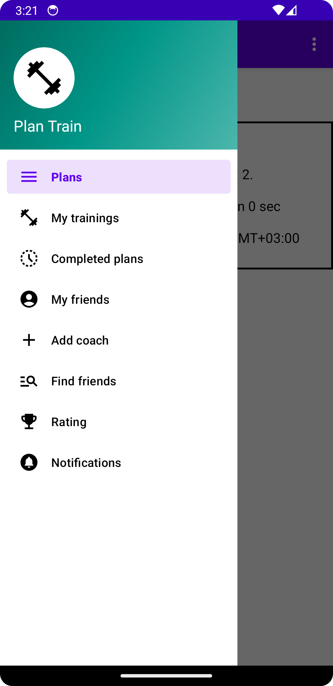

# Sport-app project "Plan-train"
Это проект, был реальзован тремя студентами 2-го курса НИУ ВШЭ СПБ:
* Залилова Диана [@mediana105](https://github.com/mediana105)
* Иванова Арина [@Arishkamu](https://github.com/Arishkamu)
* Шевченко Будимир [@minmise](https://github.com/minmise)

Наш метор: Пьянников Николай

## Содержание
1. [Содержание](#Содержание)
1. [Описание](#Описание)
1. [Dependencies](#Dependencies)
1. [Build and Run](#Build-and-Run)
    1. [Сервер](#Для-сервера)
    2. [Клиент](#Для-клентской-части)
1. [Подробное описание](#Подробное-описание)
    1. [Создание профиля](#Создать-профиль)
    2. [Текущий план](#Просмотр-текущего-плана)
    2. [Тренер](#Тренер)
    3. [Уведомления](#Уведомления)
    4. [Подписки](#Подписки)

## Описание
Данный проект представляет собой спортивное приложение на андроид созданное для помощи спортсменам и тренерам в организации
тренировочного процесса. Основной функционал включает в себя возможности:

Для спортсмена:
+ Регистрация и вход (имя, фамилия, логин, пароль)
+ Поиск и выбор тренера (также пользователя приложения)
+ Просмотр планов, тренировок и отдельных упражнений, созданных тренером
+ Возможность отметить тренировку выполненной
+ Возвожность подписаться на других пользователей
+ Просмотр тренировочного рейтинга на основе подписок

Для тренера:
+ Регистрация и вход
+ Просмотр своих спортсменов
+ Создание индивидуальных тренировочных планов, а также отдельных тренеровок
+ Отслеживание прогресса своих учеников

## Dependencies
* JDK 21
* Spring Boot 3
* PostgreSQL
* Android SDK 28+

## Build and Run
Приложение состоит из двух основных частей - сервера и клиента

#### Для сервера
1. Установить значение в файле
   `application.properties`

        spring.datasource.url=          // url path to database source
        spring.datasource.username=     // database username
        spring.datasource.password=     // database password
2. Запуск

        $ ./gradle wrapper
        $ ./gradlew :server:bootRun

#### Для клентской части
1. Установить значение в файле `local.properties`

        sdk.dir =                       // path for Android SDK directory`
2. Запуск в андроид эмуляторе или на мобильном устройстве

## Подробное описание
### Создать профиль
Для начала необходимо создать профиль - придумать уникальный никнейм и пароль. Имя и фимилия могут быть любыми. Если профиль уже создан, можно зайти используя свой логин и пароль.
Также в процессе регистрации вас попросят указать свою дату рождения, а также выбрать тип пользователя - тренер или спортсмен

### Просмотр текущего плана
Если вы спортсмен, то на главном экране увидете свой текущий план - список тренировок. Также вы можете перейти к отдельной тренировке, просмотреть упражнения и отменить как выполненное

### Тренер
Если вы тренер, то на главном экране отобразиться список ващих учеников. Нажмите на любого из них и получите подробную информацию о его тренировках

Также вы как тренер можете создать новый тренировочный план, добавить туда несколько тренировок и упражнений

### Уведомления
При создании нового плана и его редактировании (выполненно/невыполненно) тренер и спортсмен получают соответствующие увеломления, которые можно просмотреть в отдельном окне

### Подписки
Каждый спортсмен может воспользоваться поиском и подписаться на других пользователей. На основе их тренировок создается рейтинг

Рейтинг имеет следующую систему: за каждый день, в течении последней недели, в который была завершенная тренировка пользователь получает 10 очков. Эти баллы суммируются

